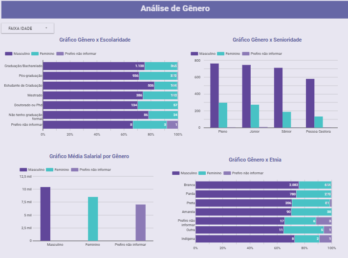
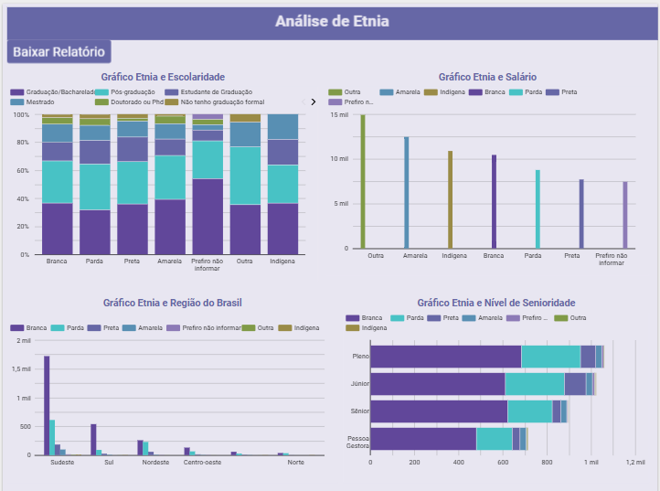

# 📊 Análise de Diversidade no Mercado de Tecnologia

Projeto desenvolvido durante o curso "Meus Primeiros Passos em Análise de Dados" da Programaria.

## Objetivo

Analisar dados de diversidade no mercado de tecnologia brasileiro considerando gênero, etnia, escolaridade, senioridade e remuneração.

## Ferramentas Utilizadas

- Python
- Pandas
- Matplotlib
- Seaborn
- Looker Studio

## Principais Análises

- Gênero x Escolaridade
- Gênero x Senioridade
- Média Salarial por Gênero
- Etnia x Escolaridade
- Etnia x Salário
- Etnia x Senioridade

## Aprendizados

- Limpeza de dados
- Análise exploratória
- Criação de visualizações
- Construção de dashboards

## Dashboard

### Análise de Gênero

### Análise de Etnia

## Relatório Completo

[📄 Clique aqui para visualizar o relatório](Relatório_Programaria_Izabela.pdf)
